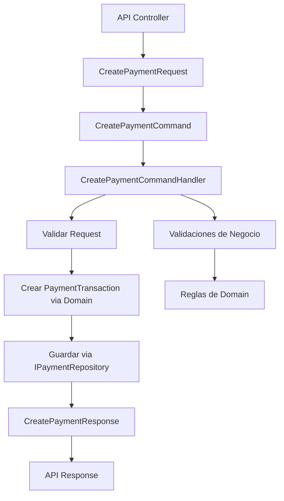

# Capa de Application - Haulmer.Payments

Esta capa contiene la lógica de aplicación del sistema de pagos, siguiendo los principios de Clean Architecture. Incluye comandos, queries, DTOs, validadores, interfaces y orquestación de casos de uso que coordinan la lógica de negocio definida en la capa Domain.

## Estructura de Clases

### Payments (Pagos)
- **CreatePaymentCommand**: Comando para crear una nueva transacción de pago. Contiene los datos necesarios para iniciar un pago.
- **CreatePaymentCommandHandler**: Manejador del comando CreatePayment. Orquesta la creación de la transacción, validaciones y persistencia.
- **CreatePaymentRequest**: DTO de solicitud para crear un pago. Incluye montos, referencias y datos del pagador.
- **CreatePaymentResponse**: DTO de respuesta para la creación de pago. Contiene el ID de transacción y estado inicial.
- **IPaymentRepository**: Interfaz para el repositorio de pagos. Define métodos para guardar y consultar transacciones.

## Modelo de Datos

La capa Application utiliza:
- DTOs para transferencia de datos entre capas.
- Requests y Responses para comunicación con la API.
- Interfaces para dependencias (repositorios, servicios externos).
- Validadores para reglas de entrada.
- Comandos y Handlers para orquestación de casos de uso.

## Diagrama de Flujo

## Pruebas Unitarias

La capa Application incluye pruebas unitarias en `tests/Haulmer.Payments.Application.UnitTests/`, organizadas por módulos para validar la orquestación de casos de uso.

### Payments
- **CreatePaymentCommandHandlerTests**: Valida el manejo del comando de creación de pago, incluyendo validaciones, creación de transacción y manejo de errores.

### Objetivos de las Pruebas
- **Validación de Orquestación**: Asegurar que los handlers coordinen correctamente las dependencias.
- **Manejo de Errores**: Probar escenarios de fallo y excepciones.
- **Integración con Domain**: Verificar que se invoquen correctamente las reglas de negocio.
- **Validaciones de Entrada**: Confirmar que los DTOs sean validados antes del procesamiento.