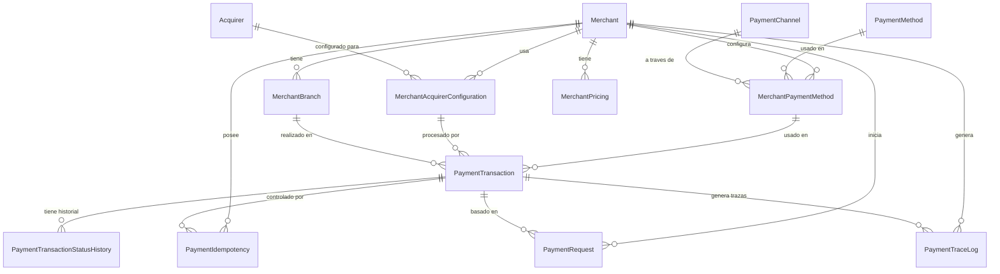

# Capa de Domain - Haulmer.Payments

Esta capa contiene la lógica de negocio central del sistema de pagos, siguiendo los principios de Domain-Driven Design (DDD) y Clean Architecture. Incluye entidades, enums y reglas de negocio que modelan el dominio de pagos para el mercado chileno.

## Estructura de Clases

### Merchants (Comerciantes)
- **Merchant**: Representa a un comerciante registrado. Contiene información básica como RUT de la empresa, nombre, contacto y estado. Tiene métodos para activar/desactivar y actualizar contacto.
- **MerchantBranch**: Sucursal de un comerciante. Vinculada a un Merchant, con dirección y estado propio.
- **MerchantStatus**: Enum que define los estados posibles de un Merchant (Active, Inactive, Suspended).

### Catalogs (Catálogos)
- **PaymentMethod**: Método de pago disponible (ej. Tarjeta de Crédito, Transferencia). Incluye código, nombre y estado.
- **PaymentChannel**: Canal de pago (ej. Web, Móvil). Define cómo se realiza el pago.
- **Acquirer**: Adquirente que procesa los pagos (ej. bancos o procesadores).
- **PaymentMethodStatus, PaymentChannelStatus, AcquirerStatus**: Enums para estados de cada catálogo (Active, Inactive).

### MerchantSetup (Configuración de Comerciante)
- **MerchantPaymentMethod**: Configuración de un método de pago para un comerciante específico. Incluye comisiones y límites.
- **MerchantAcquirerConfiguration**: Configuración del adquirente para un comerciante, con credenciales y parámetros.
- **MerchantPricing**: Modelo de precios y comisiones para un comerciante.
- **MerchantPaymentMethodStatus, MerchantAcquirerConfigurationStatus, MerchantPricingStatus**: Enums para estados de configuración (Enabled, Disabled, Expired).

### Payments (Pagos)
- **PaymentTransaction**: Entidad principal de transacción de pago. Contiene montos, estados, referencias y métodos para cambiar estado (MarkAsProcessing, MarkAsApproved, etc.).
- **PaymentTransactionStatusHistory**: Historial de cambios de estado de una transacción. Registra cada transición con razones y códigos.
- **PaymentIdempotency**: Maneja la idempotencia de solicitudes de pago. Previene duplicados usando clave y hash de solicitud.
- **PaymentTraceLog**: Registra trazas técnicas de la transacción para auditoría y debugging.
- **PaymentRequest**: Almacena la solicitud original de pago en JSON para referencia.
- **PaymentTransactionStatus**: Enum para estados de transacción (Pending, Processing, Approved, Declined, Failed).
- **PaymentIdempotencyStatus**: Enum para estados de idempotencia (InProgress, Completed, Failed, Expired).
- **TraceSeverity**: Enum para niveles de severidad de trazas (Info, Warning, Error).

## Modelo de Datos

Todas las entidades usan:
- Identificadores long autoincrementales.
- Timestamps en UTC y local (Chile).
- Propiedades privadas con setters.
- Métodos estáticos de creación (Create) con validaciones.
- Enums para estados y tipos.

## Diagrama Relacional

## Pruebas Unitarias

La capa Domain incluye un conjunto completo de pruebas unitarias en `tests/Haulmer.Payments.Domain.UnitTests/`, organizadas por módulos para validar la lógica de negocio.

### Merchants
- **MerchantTests**: Valida creación de comerciantes, activación/desactivación, actualizaciones de contacto y transiciones de estado.
- **MerchantBranchTests**: Verifica creación de sucursales, validaciones de MerchantId y cambios de estado.

### Catalogs
- **PaymentMethodTests**: Prueba creación de métodos de pago y validaciones básicas.
- **PaymentChannelTests**: Valida canales de pago.
- **AcquirerTests**: Verifica adquirentes.

### MerchantSetup
- **MerchantPaymentMethodTests**: Valida configuraciones de métodos de pago por comerciante, incluyendo fechas de vigencia.
- **MerchantAcquirerConfigurationTests**: Prueba configuraciones de adquirentes con credenciales.
- **MerchantPricingTests**: Verifica modelos de precios y comisiones.

### Payments
- **PaymentTransactionTests**: Prueba creación de transacciones, validaciones de montos y estados, transiciones de estado (Pending → Processing → terminales).
- **PaymentTransactionStatusHistoryTests**: Valida registro de historial de estados con códigos de razón.
- **PaymentIdempotencyTests**: Verifica control de idempotencia, asignación de transacciones y expiración.
- **PaymentTraceLogTests**: Prueba registro de trazas técnicas con severidad.
- **PaymentRequestTests**: Valida almacenamiento de solicitudes de pago.

### Objetivos de las Pruebas
- **Validación de Creación**: Asegurar que las entidades se creen correctamente con datos válidos y rechacen inválidos.
- **Reglas de Negocio**: Probar invariantes como montos > 0, estados terminales no transitables, idempotencia.
- **Manejo de Estados**: Validar transiciones permitidas y excepciones en transiciones inválidas.
- **Integridad de Datos**: Verificar trimming de strings, manejo de nulos y formatos requeridos.
- **Cobertura Completa**: Cada método público y regla de validación tiene al menos un test.

Las pruebas usan xUnit, FluentAssertions y siguen el patrón Arrange-Act-Assert para mantener claridad y mantenibilidad.