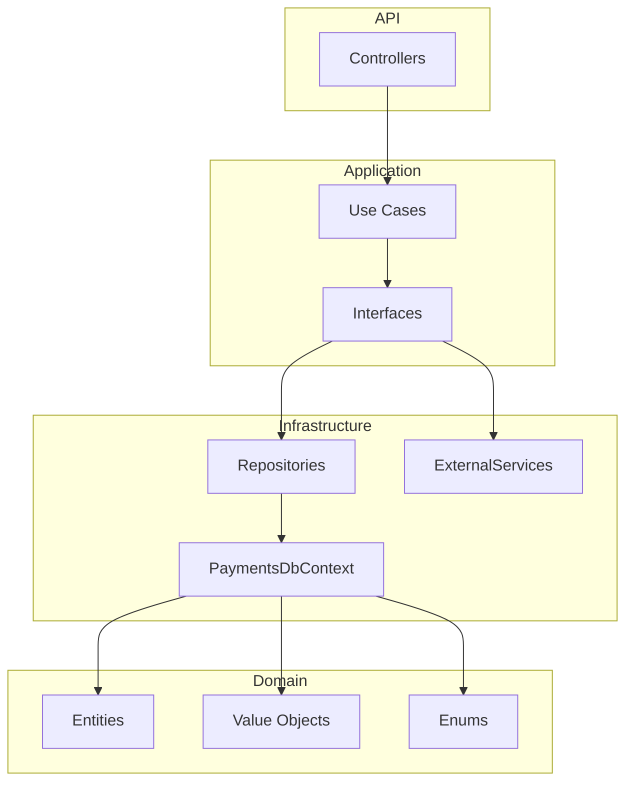

# Capa de Infrastructure - Haulmer.Payments

Esta capa implementa la infraestructura técnica y la persistencia de datos del sistema de pagos, siguiendo Clean Architecture. Aquí se encuentran las configuraciones de EF Core, los repositorios, servicios externos simulados y la integración con SQL Server.

## Estructura de la Capa

- **Persistence/**: Configuración de EF Core, DbContext, mapeos explícitos y migraciones.
  - `PaymentsDbContext`: Contexto principal de EF Core para todas las entidades del dominio.
  - `Configurations/`: Configuraciones explícitas de entidades usando Fluent API (`IEntityTypeConfiguration<T>`), definiendo tablas, claves, relaciones, índices y precisión decimal.
  - `Repositories/`: Implementaciones de los repositorios definidos en Application. Incluyen UnitOfWork y acceso a datos asincrónico.
- **ExternalServices/**: Implementaciones de servicios externos simulados (por ejemplo, autorización bancaria determinística para pruebas).
- **DependencyInjection/**: Extensiones para registrar todos los servicios, repositorios y DbContext en el contenedor DI de ASP.NET Core.

## Principios y Convenciones

- **Persistencia**: Todas las entidades se mapean explícitamente, sin anotaciones en Domain. Se usa SQL Server en producción y SQLite en memoria para pruebas.
- **DbContext**: Aplica todas las configuraciones desde la carpeta `Configurations` y expone un DbSet por cada entidad del dominio.
- **Repositorios**: Implementan interfaces de Application, usan consultas asincrónicas y `AsNoTracking` para lecturas. No contienen lógica de negocio.
- **Servicios Externos**: Simulados para pruebas, deterministas y sin dependencias externas reales.
- **Inyección de Dependencias**: Todo se registra explícitamente en `InfrastructureServiceCollectionExtensions`.

## Ejemplo de Diagrama de Componentes

## Pruebas de Integración

La capa Infrastructure incluye pruebas de integración en `tests/Haulmer.Payments.Infrastructure.IntegrationTests/`, usando SQLite en memoria y entidades reales del dominio. Se validan:
- Persistencia y consultas de repositorios.
- Integración de servicios externos simulados.
- Configuración y restricciones de EF Core (índices, claves únicas, precisión decimal).

## Objetivos
- **Aislar la lógica de infraestructura**: Mantener la persistencia y servicios externos desacoplados de la lógica de negocio.
- **Configuración explícita y profesional**: Todo mapeo y registro es explícito y alineado a Clean Architecture.
- **Facilitar pruebas y evolución**: Infraestructura lista para pruebas, migraciones y cambios futuros sin afectar Domain ni Application.
